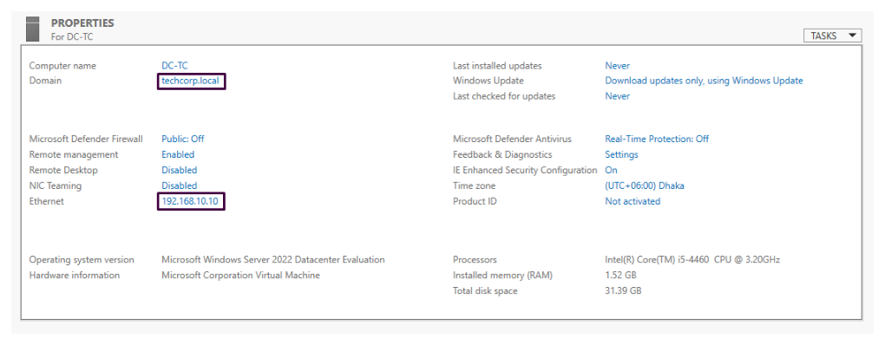
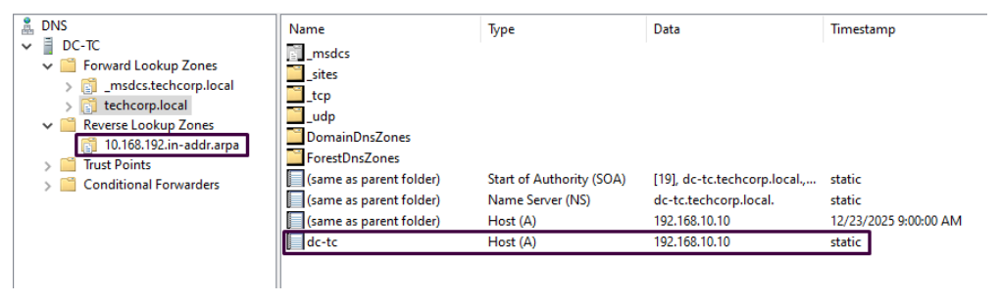
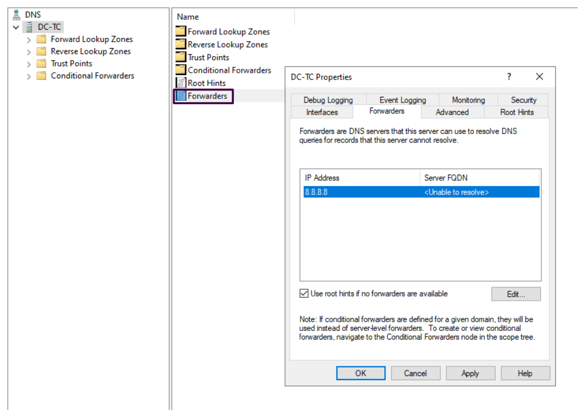
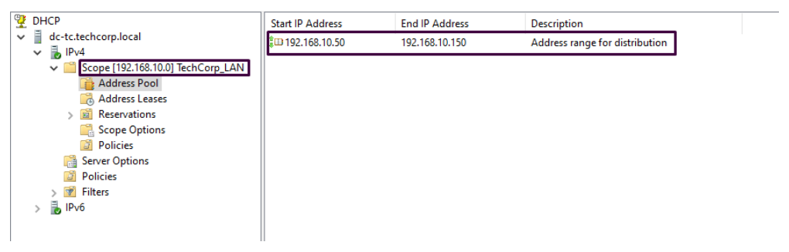
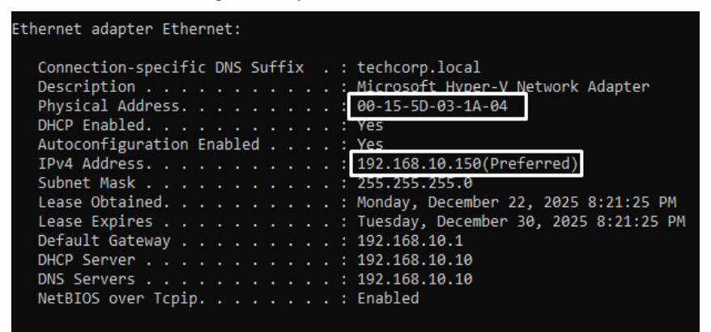
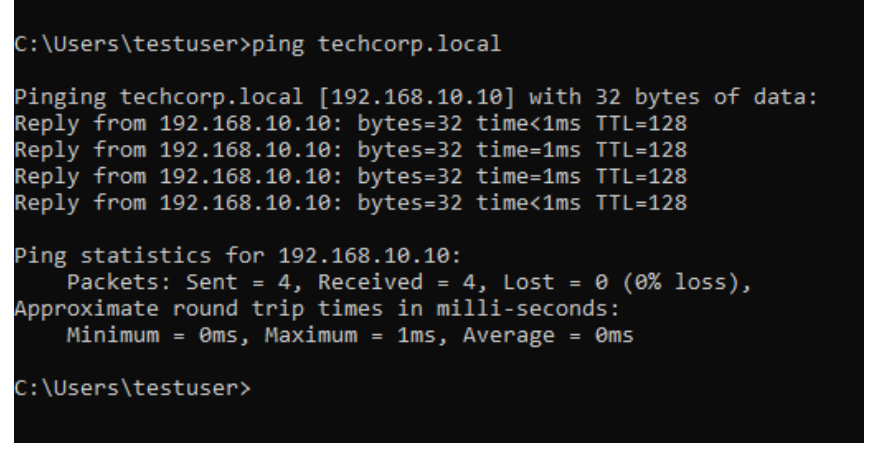
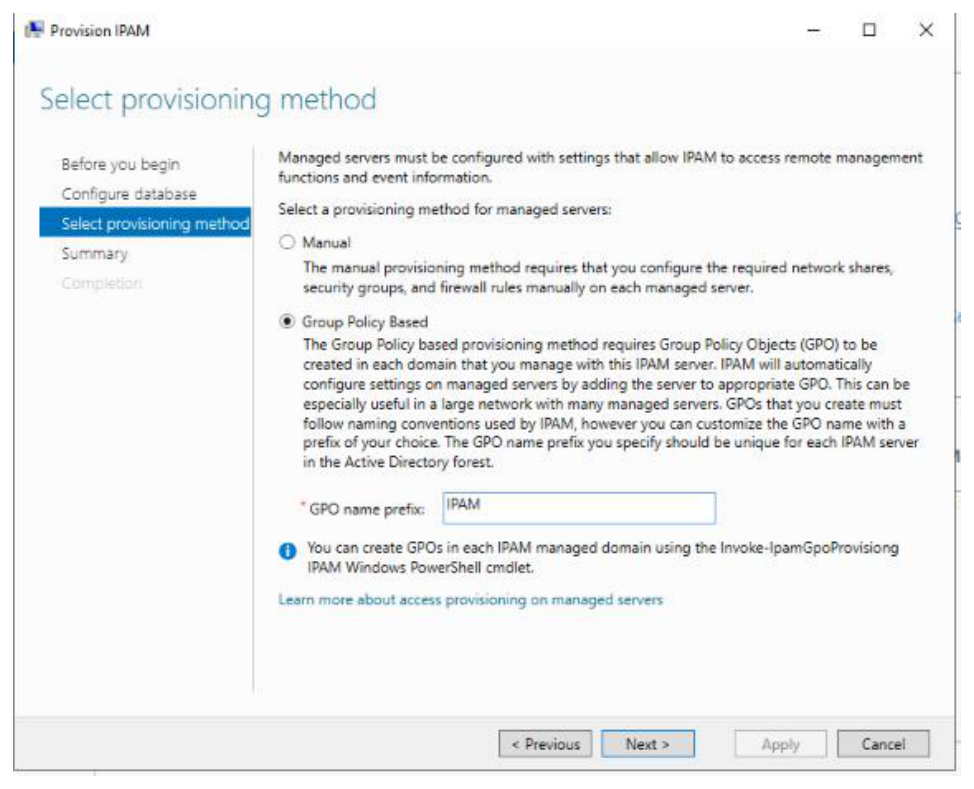
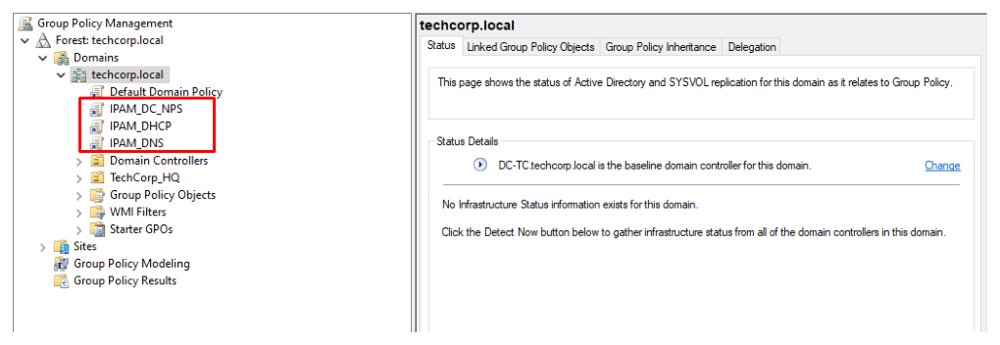

# Windows Server 2022 Branch Office Infrastructure Deployment

A practical branch-office infrastructure project built on **Windows Server 2022**, focused on deploying and validating the core services that make a domain-based office network work in the real world: **Active Directory Domain Services, DNS, DHCP, Group Policy, and IP Address Management (IPAM).**

## Why this project matters
This repository demonstrates the type of integrated infrastructure work expected from a junior system administrator in a branch or SMB environment. Instead of treating each service in isolation, the project shows how identity, name resolution, IP assignment, policy enforcement, and visibility come together as one working platform.

## Project Scope

| Area | Implementation |
|---|---|
| Identity Services | AD DS forest and domain deployment |
| Name Resolution | Forward and reverse DNS zones + forwarder |
| Address Management | DHCP scope, options, and reservation |
| Governance | Organizational Unit design + GPO enforcement |
| Visibility | IPAM deployment and GPO-based provisioning |

## Environment Summary

| Item | Value |
|---|---|
| Platform | Windows Server 2022 Datacenter |
| Domain | `techcorp.local` |
| Domain Controller Hostname | `DC-TC` |
| Server IPv4 | `192.168.10.10/24` |
| Branch Gateway | `192.168.10.1` |
| DNS Forwarder | `8.8.8.8` |

## What I implemented

### 1. Active Directory Domain Services and DNS
I promoted the server to a Domain Controller, created the **`techcorp.local`** domain, configured an **AD-integrated forward lookup zone**, and created the matching **reverse lookup zone** for branch-office name resolution and service discovery.

### 2. DHCP Deployment
I installed and authorized DHCP in Active Directory, then created a client allocation scope named **`TechCorp_LAN`** with clear separation between infrastructure IPs and client leases.

### 3. Group Policy and OU Design
I designed Organizational Units for centralized governance and applied Group Policy for:
- interactive logon messaging
- drive mapping via Group Policy Preferences
- user environment restriction / Control Panel access control

### 4. IPAM Deployment
I deployed **IP Address Management (IPAM)** to centralize monitoring for:
- DHCP scopes
- DNS zones
- lease visibility
- IP utilization

## Key Configuration Highlights

### DHCP Scope Design
- **Scope name:** `TechCorp_LAN`
- **Address pool:** `192.168.10.50 - 192.168.10.150`
- **Subnet mask:** `255.255.255.0`
- **Excluded range:** `192.168.10.1 - 192.168.10.49`

### DHCP Options
- **Option 003 (Router):** `192.168.10.1`
- **Option 006 (DNS Server):** `192.168.10.10`
- **Option 015 (Domain Name):** `techcorp.local`

### DNS Design
- **Forward zone:** `techcorp.local`
- **Reverse zone:** `10.168.192.in-addr.arpa`
- **Dynamic updates:** Secure only

## Validation Checklist

- [x] Domain controller promotion completed successfully
- [x] DNS zones created and resolving properly
- [x] External name resolution working through DNS forwarder
- [x] DHCP clients receiving lease, gateway, DNS, and domain suffix
- [x] GPO linked and enforced at OU level
- [x] IPAM discovering and displaying managed services

## Screenshots

### Domain Controller Deployment


### DNS Zone Configuration


### DNS Forwarder and Validation


### DHCP Scope Configuration


### GPO Legal Notice


### GPO Drive Mapping


### IPAM Managed Servers


### IPAM GPO Objects


## Skills Demonstrated
- Windows Server role deployment
- Active Directory domain setup
- DNS forward and reverse zone management
- DHCP scope engineering
- Group Policy administration
- IPAM provisioning and validation
- Documentation and service verification

## Repository Structure
```text
.
├── README.md
├── images/
└── docs/
    ├── implementation-summary.md
    ├── validation-checklist.md
    └── repo-metadata.md
```

## Recruiter Snapshot
This project shows my ability to deploy and validate a **complete branch-office infrastructure stack** rather than a single isolated service. It reflects practical understanding of how core Windows services work together in a production-like environment.
